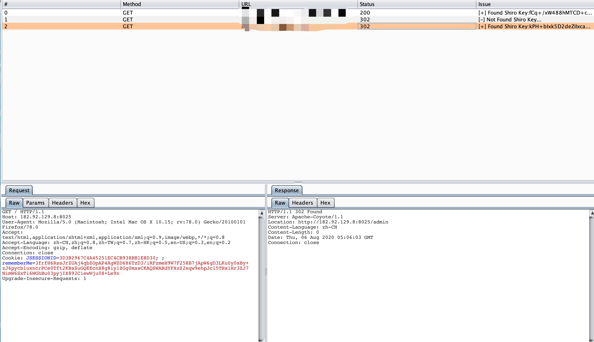

# ShiroScan
burp插件 Shiroscan 主要用于框架、无dnslog key检测

无dnslog检测基于https://mp.weixin.qq.com/s/do88_4Td1CSeKLmFqhGCuQ

# 使用截图

将ShiroScan.jar导入burp，该插件是被动扫描，扫描成功的结果会输出到图形界面中

同时在burp的issue里也会输出相应的详情信息

# 版本更新

- 修复响应中包含多个rememberMe=deleteMe时漏报的问题
- 将检测成功的cookie信息同步与request包中

师傅们在使用过程中遇到问题请及时反馈。感谢。