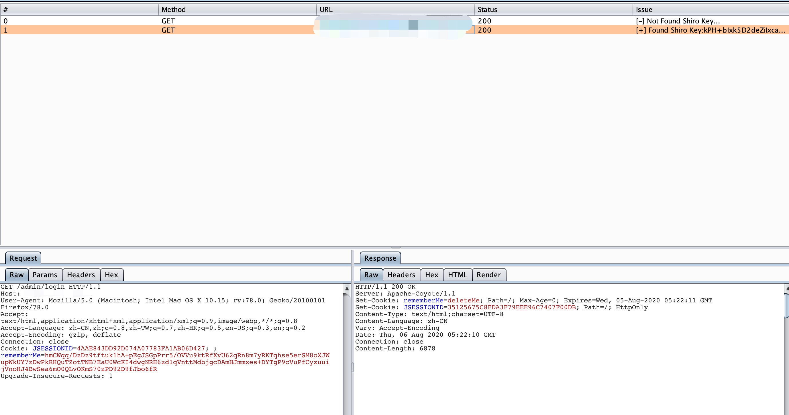
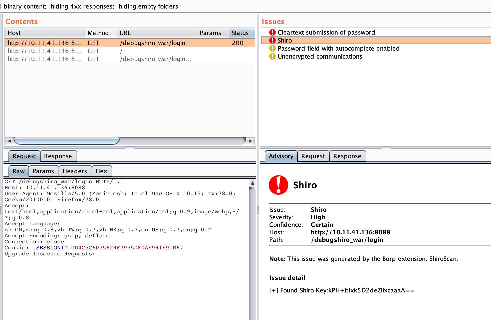

# ShiroScan
burp插件 Shiroscan 主要用于框架、无dnslog key检测

无dnslog检测基于https://mp.weixin.qq.com/s/do88_4Td1CSeKLmFqhGCuQ

# 免责声明
该工具仅用于安全自查检测

由于传播、利用此工具所提供的信息而造成的任何直接或者间接的后果及损失，均由使用者本人负责，作者不为此承担任何责任。

本人拥有对此工具的修改和解释权。未经网络安全部门及相关部门允许，不得善自使用本工具进行任何攻击活动，不得以任何方式将其用于商业目的。

# 使用截图

将ShiroScan.jar导入burp，该插件是被动扫描，扫描成功的结果会输出到图形界面中

同时在burp的issue里也会输出相应的详情信息

# 版本更新

- 修复响应中包含多个rememberMe=deleteMe时漏报的问题
- 将检测成功的cookie信息同步与request包中
- 修复检测完key后列表才会显示,现在检测到为shiro框架后回先将url添加到列表中，等到key检测完再将key检测的结果更新

师傅们在使用过程中遇到问题请及时反馈。感谢。
